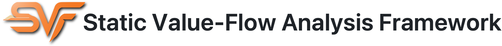

<b>SVF</b> is a static value-flow analysis tool for LLVM-based languages.

## News
* <b>[On-demand program slicing](https://github.com/SVF-tools/SVF/tree/master/svf/include/MTA) published in our [ISSTA paper](https://joelyyoung.github.io/pdf/issta26.pdf) is now available in SVF </b>
* <b>SVF now supports [LLVM-22](https://github.com/SVF-tools/SVF/pull/1876) (Contributed by [Giorgio](https://github.com/dg1474)). </b>
* <b>SVF now supports [LLVM-21](https://github.com/SVF-tools/SVF/pull/1815) (Contributed by [cjsrxzdyzds](https://github.com/cjsrxzdyzds)). </b>
* <b>SVF now supports new [build system](https://github.com/SVF-tools/SVF/pull/1703) (Thank [Johannes](https://github.com/Johanmyst) for his help!). </b>
* <b> [SVF-Python](https://github.com/SVF-tools/SVF-Python) is now available, enabling developers to write static analyzers in Python by leveraging the SVF library (Contributed by [Jiawei Wang](https://github.com/bjjwwang)). </b>
* <b>New course [Software Security Analysis](https://github.com/SVF-tools/Software-Security-Analysis) for learning code analysis and verification with SVF for fun and expertise! </b>
* <b>SVF now supports LLVM-16.0.0 with opaque pointers (Contributed by [Xiao Cheng](https://github.com/jumormt)). </b>
* <b>Modernize SVF's CMake (Contributed by [Johannes](https://github.com/Johanmyst)). </b>

Older news

* <b>SVF now supports LLVM-13.0.0 (Thank [Shengjie Xu](https://github.com/xushengj) for his help!). </b>
* <b>[Object clustering](https://github.com/SVF-tools/SVF/wiki/Object-Clustering) published in our [OOPSLA paper](https://yuleisui.github.io/publications/oopsla21.pdf) is now available in SVF </b>
* <b>[Hash-Consed Points-To Sets](https://github.com/SVF-tools/SVF/wiki/Hash-Consed-Points-To-Sets) published in our [SAS paper](https://yuleisui.github.io/publications/sas21.pdf) is now available in SVF </b>
* <b> Learning or teaching Software Analysis? Check out [SVF-Teaching](https://github.com/SVF-tools/SVF-Teaching)! </b>
* <b>SVF now supports LLVM-12.0.0 (Thank [Xiyu Yang](https://github.com/sherlly/) for her help!). </b>
* <b>[VSFS](https://github.com/SVF-tools/SVF/wiki/VSFS) published in our [CGO paper](https://yuleisui.github.io/publications/cgo21.pdf) is now available in SVF </b>
* <b>[TypeClone](https://github.com/SVF-tools/SVF/wiki/TypeClone) published in our [ECOOP paper](https://yuleisui.github.io/publications/ecoop20.pdf) is now available in SVF </b>
* <b>SVF now uses a single script for its build. Just type [`source ./build.sh`](https://github.com/SVF-tools/SVF/blob/master/build.sh) in your terminal, that's it!</b>
* <b>SVF now supports LLVM-10.0.0! </b>
* <b>We thank [bsauce](https://github.com/bsauce) for writing a user manual of SVF ([link1](https://www.jianshu.com/p/068a08ec749c) and [link2](https://www.jianshu.com/p/777c30d4240e)) in Chinese </b>
* <b>SVF now supports LLVM-9.0.0 (Thank [Byoungyoung Lee](https://github.com/SVF-tools/SVF/issues/142) for his help!). </b>
* <b>SVF now supports a set of [field-sensitive pointer analyses](https://yuleisui.github.io/publications/sas2019a.pdf). </b>
* <b>[Use SVF as an external lib](https://github.com/SVF-tools/SVF-example) for your own project (Contributed by [Hongxu Chen](https://github.com/HongxuChen)). </b>
* <b>SVF now supports LLVM-7.0.0. </b>
* <b>SVF now supports Docker. [Try SVF in Docker](https://github.com/SVF-tools/SVF/wiki/Try-SVF-in-Docker)! </b>
* <b>SVF now supports [LLVM-6.0.0](https://github.com/svf-tools/SVF/pull/38) (Contributed by [Jack Anthony](https://github.com/jackanth)). </b>
* <b>SVF now supports [LLVM-4.0.0](https://github.com/svf-tools/SVF/pull/23) (Contributed by Jared Carlson. Thank [Jared](https://github.com/jcarlson23) and [Will](https://github.com/dtzWill) for their in-depth [discussions](https://github.com/svf-tools/SVF/pull/18) about updating SVF!) </b>
* <b>SVF now supports analysis for C++ programs.</b>

## Documentation

| About SVF       | Setup  Guide         | User Guide  | Developer Guide  |
| ------------- |:-------------:| -----:|-----:|
| |   |   |  
| Introducing SVF -- [what it does](https://github.com/svf-tools/SVF/wiki/About#what-is-svf) and [how we design it](https://github.com/svf-tools/SVF/wiki/SVF-Design#svf-design)      | A step by step [setup guide](https://github.com/svf-tools/SVF/wiki/Setup-Guide#getting-started) to build SVF | Command-line options to [run SVF](https://github.com/svf-tools/SVF/wiki/User-Guide#quick-start), get [analysis outputs](https://github.com/svf-tools/SVF/wiki/User-Guide#analysis-outputs), and test SVF with [an example](https://github.com/svf-tools/SVF/wiki/Analyze-a-Simple-C-Program) or [PTABen](https://github.com/SVF-tools/PTABen) | Detailed [technical documentation](https://github.com/svf-tools/SVF/wiki/Technical-documentation) and how to [write your own analyses](https://github.com/svf-tools/SVF/wiki/Write-your-own-analysis-in-SVF) in SVF or [use SVF as a lib](https://github.com/SVF-tools/SVF-example) for your tool, and the [course](https://github.com/SVF-tools/Software-Security-Analysis) on SVF  |

<b>SVF</b>'s doxygen document is available [here](https://svf-tools.github.io/SVF-doxygen/html).

## Features and Publications

<b>SVF</b> ([CC'16](https://dl.acm.org/doi/10.1145/2892208.2892235)) is able to perform
* [AE](https://github.com/SVF-tools/SVF/tree/master/svf/include/AE) (<b>abstract execution</b>): cross-domain execution ([ICSE'24](https://dl.acm.org/doi/10.1145/3597503.3639220)), selective widening ([OOPSLA'25](https://dl.acm.org/doi/10.1145/3763083)), recursion analysis ([ECOOP'25](https://drops.dagstuhl.de/entities/document/10.4230/LIPIcs.ECOOP.2025.34)), typestate analysis ([FSE'24](https://dl.acm.org/doi/10.1145/3643749));
* [WPA](https://github.com/SVF-tools/SVF/tree/master/svf/include/WPA) (<b>whole program analysis</b>): field-sensitive ([SAS'19](https://link.springer.com/chapter/10.1007/978-3-030-32304-2_3)), flow-sensitive ([CGO'21](https://ieeexplore.ieee.org/document/9370334), [OOPSLA'21](https://dl.acm.org/doi/10.1145/3485547)) analysis;
* [DDA](https://github.com/SVF-tools/SVF/tree/master/svf/include/DDA) (<b>demand-driven analysis</b>): flow-sensitive, context-sensitive points-to analysis ([FSE'16](https://dl.acm.org/doi/10.1145/2950290.2950296), [TSE'18](https://doi.org/10.1109/TSE.2018.2869336));
* [MSSA](https://github.com/SVF-tools/SVF/tree/master/svf/include/MSSA) (<b>memory SSA form construction</b>): memory regions, side-effects, SSA form ([JSS'18](https://doi.org/10.1016/j.jss.2018.09.038));
* [SABER](https://github.com/SVF-tools/SVF/tree/master/svf/include/SABER) (<b>memory error checking</b>): memory leaks and double-frees ([ISSTA'12](https://dl.acm.org/doi/10.1145/2338965.2336784), [TSE'14](https://doi.org/10.1109/TSE.2014.2302311), [ICSE'18](https://dl.acm.org/doi/10.1145/3180155.3180178));
* [MTA](https://github.com/SVF-tools/SVF/tree/master/svf/include/MTA) (<b>analysis of multithreaded programs</b>): value-flows for multithreaded programs ([CGO'16](https://dl.acm.org/doi/10.1145/2854038.2854043)), on-demand program slicing ([ISSTA'26](https://joelyyoung.github.io/pdf/issta26.pdf));
* [CFL](https://github.com/SVF-tools/SVF/tree/master/svf/include/CFL) (<b>context-free-reachability analysis</b>): standard CFL solver, graph and grammar ([OOPSLA'22](https://dl.acm.org/doi/10.1145/3563343), [PLDI'23](https://dl.acm.org/doi/10.1145/3591233));
* [SVFIR](https://github.com/SVF-tools/SVF/tree/master/svf/include/SVFIR) and [MemoryModel](https://github.com/SVF-tools/SVF/tree/master/svf/include/MemoryModel) (<b>SVFIR</b>): SVFIR, memory abstraction and points-to data structure ([SAS'21](https://link.springer.com/chapter/10.1007/978-3-030-88806-0_2));
* [Graphs](https://github.com/SVF-tools/SVF/tree/master/svf/include/Graphs): <b> generating a variety of graphs</b>, including call graph, ICFG, class hierarchy graph, constraint graph, value-flow graph for static analyses and code embedding ([OOPSLA'20](https://dl.acm.org/doi/10.1145/3428301), [TOSEM'21](https://dl.acm.org/doi/10.1145/3436877))

We release the SVF source code with the hope of benefiting the open-source community. You are kindly requested to acknowledge usage of the tool by referring to or citing relevant publications above. 

